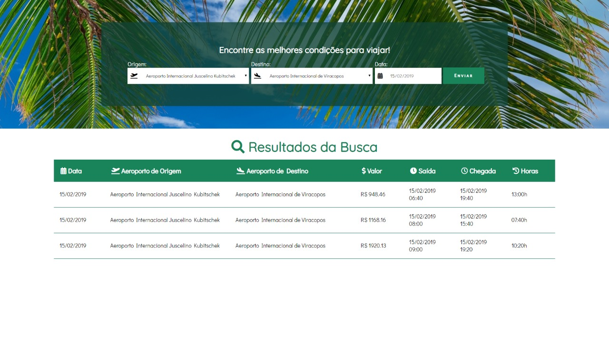

# Search Flight Application
## (Desafio Tegra)

## Descrição

O objetivo do projeto foi criar uma SPA (Single Page Application), onde o usuário informa um aeroporto de origem, um aeroporto de destino e uma data, e com esses dados ele recebe informações de voo ao clicar num botão. Informações como data, nome dos aeroportos, valor do voo (considerando escalas), data e horário do voo e sua chegada, e o tempo total da origem até o destino.
Esse projeto foi desenvolvido utilizandos tecnologias como: ReactJs, Redux e Typescript.



## Funcionalidades

- Requisições assíncronas GET e POST ao backend.
- Consumo da API dentro dos componentes.
- Dados do voo exibidos na tela (data, origem, destino, hora saida, hora chegada, valor total e total de horas).
- Cálculo de valor total dos voos com escalas.
- Cálculo de horas totais dos voos com escalas.
- Tratamento para buscas vazias.

## Instalação

Para ter a aplicação rodando na sua máquina:

- Clone esse repositório pelo terminal clicando no botão verde escrito *Clone or Download* acima no canto direito da tela e copie a url
No seu terminal digite:
```
git clone URL
```
- Substitua URL por:
```
https://github.com/gilsonDias92/desafio-estagio-tegra-heroway.git
```
- Isso vai fazer com que você possa copiar todos os aquivos do repositório na sua máquina.

- No seu terminal, navegue até a pasta em que o repositório foi clonado, e digite o seguinte comando na **raiz** do projeto (ele irá instalar todas as depêndencias necessárias):

```
npm install
```

- E finalmente, por último, mas não menos importante, vamos rodar o projeto, digite:
```
npm start
```
- Para dar uma olhada no código, escolha um editor de sua preferência, prepare um café e pronto!! ;)


